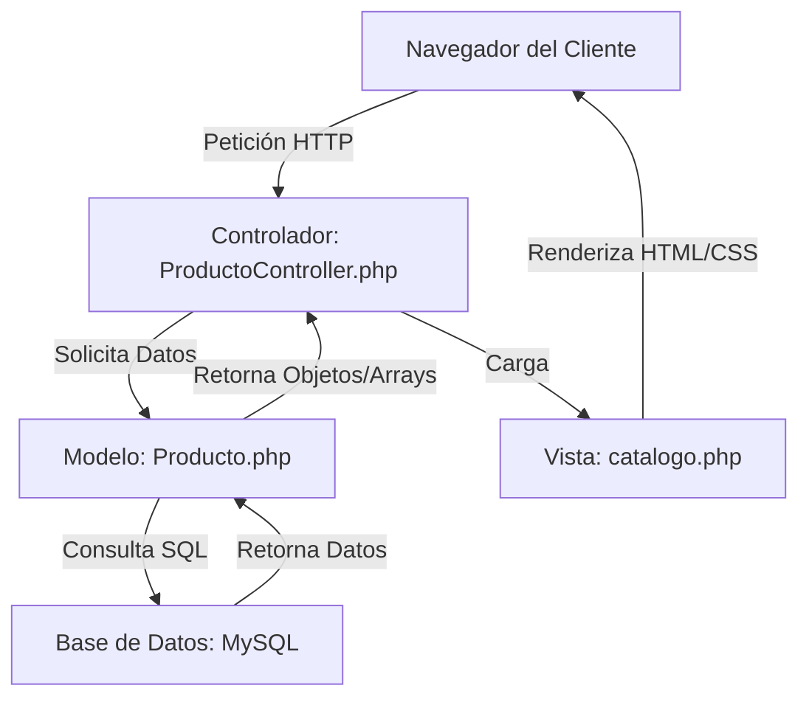

TechHub Store ✨🌸
**E-commerce de tecnología con estética Kawaii desarrollado en PHP.**

Este proyecto es una aplicación web dinámica que implementa un flujo completo de compras, desde el registro de usuarios hasta la confirmación de pedidos, utilizando una arquitectura MVC **(Modelo-Vista-Controlador)** simplificada.

---

## Funcionalidades Principales
- **Catálogo Dinámico:** Visualización de productos en tiempo real desde base de datos.
- **Gestión de Stock:** Bloqueo automático de productos agotados y descuento de inventario tras la compra.
- **Carrito de Compras (AJAX):** Agregado de productos sin recargar la página para una mejor experiencia de usuario.
- **Manejo de Sesiones:** Registro, Login y persistencia de datos del cliente.
- **Simulación de Pago:** Proceso de validación de compra con feedback visual (5 segundos).
- **Historial de Órdenes:** Generación de códigos únicos de pedido y guardado en base de datos.

## Arquitectura del Sistema (MVC)

El proyecto sigue el patrón de diseño **Modelo-Vista-Controlador**, lo que permite una separación clara entre la lógica de datos, la interfaz y el control de procesos.



## Requisitos del Entorno
Para ejecutar esta aplicación en un entorno local controlado:
- **XAMPP** (Versión 8.0 o superior recomendada).
- **Servidor Apache** y motor de base de datos **MySQL**.
- Navegador web moderno (Chrome, Edge, etc.).

---

## Instalación y Configuración
Siga estos pasos para desplegar el proyecto localmente:

1. **Descargar el proyecto:**
   Clonar este repositorio o descarga el archivo `.zip` en la carpeta `C:\xampp\htdocs\techhub`.

2. **Preparar la Base de Datos:**
   - Inicia el panel de control de **XAMPP** y activa Apache y MySQL.
   - Accede a `http://localhost/phpmyadmin/`.
   - Crea una nueva base de datos llamada `techhub_db`.
   - Selecciona la base de datos y ve a la pestaña **"Importar"**.
   - Selecciona el archivo `techhub_db.sql` incluido en la raíz de este proyecto y presiona "Ejecutar".

3. **Configuración de Conexión:**
   Asegurar de que el archivo `app/Core/Database.php` tenga las credenciales correctas:
   - **Host:** localhost
   - **DB Name:** techhub_db
   - **User:** root
   - **Password:** "" (vacío por defecto en XAMPP)

4. **Acceso a la Aplicación:**
   Abra el navegador y entra a:
   `http://localhost/techhub/public/index.php`

**NOTA ANEXA: El archivo techhub_db.sql incluye tanto el script de creación de tablas (DDL) como la inserción de datos maestros (DML) para que la tienda sea funcional desde el primer momento.**   

---

## 📂 Estructura del Proyecto
```text
techhub/
├── app/          # Lógica de negocio (Controladores, Modelos y Core)
├── public/       # Archivos de acceso público (index, CSS, JS, Imágenes)
├── views/        # Archivos de presentación (HTML/PHP)
└── techhub_db.sql # Script de la base de datos
```
---

Endpoints y Funciones Principales

**1. Gestión de Catálogo e Inventario**
ProductoController::index(): Función principal que solicita todos los productos al modelo y los envía a la vista del catálogo.

Producto::obtenerTodos(): Consulta SQL que trae nombre, precio, imagen y stock actual.

Producto::descontarStock($id, $cantidad): Función crítica que resta las unidades de la base de datos cuando una compra se completa con éxito.

**2. Sistema de Carrito (AJAX)**
public/carrito_ajax.php: El endpoint que recibe las peticiones en segundo plano para agregar productos sin que la página se refresque.

carrito_add.php: Procesa la lógica de verificar si el producto ya está en la sesión y suma las cantidades.

**3. Autenticación y Usuarios**
login_action.php: Valida las credenciales del usuario contra la tabla usuarios e inicia la $_SESSION.

registro_action.php: Endpoint encargado de recibir los datos del nuevo cliente (incluyendo la dirección de envío) y guardarlos de forma permanente.

**4. Flujo de Pago**
pago.php: Endpoint que simula la pasarela de pago y, tras los 5 segundos de espera, dispara la creación de la orden en la base de datos.

AUTORA: **ALEJANDRA PRIETO** - **Desarrollo Full Stack** - **alejandradev00**
